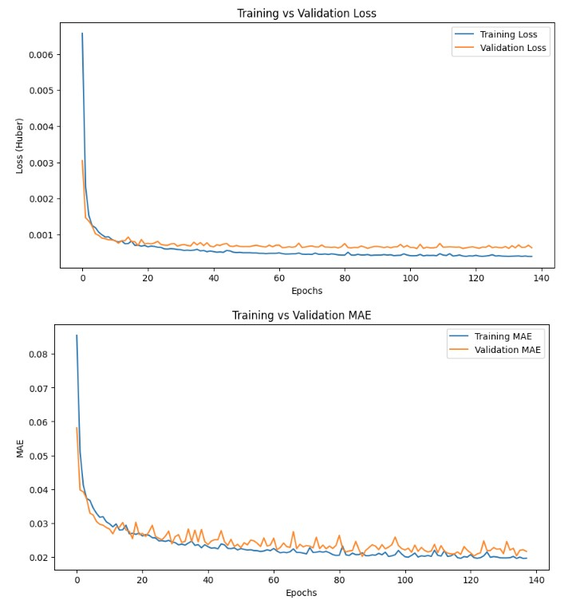

# CTA Ridership Time Series Analysis

## Overview
This project analyzes Chicago Transit Authority (CTA) daily ridership data to understand patterns and trends in public transportation usage across bus and rail systems.

## Dataset
- **Source**: CTA Daily Boarding Totals
- **File**: `CTA_-_Ridership_-_Daily_Boarding_Totals_20250901.csv`
- **Time Period**: January 2022 - May 2025
- **Metrics**: Daily ridership counts for bus and rail systems

## Data Processing

### Initial Data Loading
- Loads CTA ridership data with automatic date parsing
- Renames columns for cleaner analysis: `date`, `day_type`, `bus`, `rail`
- Sets date as index and sorts chronologically
- Removes redundant total column (bus + rail)
- Handles duplicate entries

### Data Cleaning
- Converts numeric columns from string format (removes commas)
- Ensures proper integer data types for ridership counts

## Dependencies
```python
import pandas as pd
from pathlib import Path
import matplotlib.pyplot as plt
from statsmodels.tsa.arima.model import ARIMA
import tensorflow as tf
```

## Project Structure
```
├── CTA_-_Ridership_-_Daily_Boarding_Totals_20250901.csv
├── [Timeseries Analysis.ipynb]
└── README.md
```

## Project Scope
This project implements and compares **11 different time series forecasting models** to predict CTA rail ridership:

### Univariate Models (Models 1-5)
- **Target**: Rail ridership forecasting
- **Forecast Horizons**: 
  - Next day (1-day ahead)
  - Short-term (14-days ahead)
- **Approach**: Single variable time series analysis using historical rail ridership patterns

### Multivariate Models (Models 6-11)
- **Target**: Rail ridership forecasting using multiple input features
- **Features**:
  - **Bus ridership**: Correlated transportation mode
  - **Rail ridership**: Historical values  
  - **Day type**: One-hot encoded categorical feature (next day's type)
- **Data Engineering**:
  - Scaled to millions (÷ 1e6) for numerical stability
  - Future day type shift: Uses known next-day information
  - One-hot encoding for categorical day types
  - Float32 precision for computational efficiency
- **Enhanced Capability**: Leverages cross-modal relationships and calendar information

#### Multivariate Dataset Configuration
- **Sequence Length**: 56 days (8-week lookback window)
- **Target**: Rail ridership (next day prediction)
- **Input Features**: All multivariate features over 56-day sequences
- **Batch Size**: 32
- **Training**: Shuffled with seed=42 for reproducibility
- **Validation**: Sequential (no shuffling)

#### Model 6: RNN Model (Multivariate)
- **Architecture**: Simple RNN (32 units) + Dense output layer
- **Input Shape**: [None, 5] - 5 features from multivariate dataset
  - Bus ridership
  - Rail ridership  
  - One-hot encoded day types (3 categories)
- **Advantage**: Can leverage cross-modal relationships and calendar information
- **Training**: Same hyperparameters as univariate RNN models

#### Model 7: 14-Day Ahead RNN (Multivariate)
- **Architecture**: Simple RNN (32 units) + Dense(14) output layer
- **Forecast Horizon**: 14 days ahead (multi-step forecasting)
- **Input Features**: Same 5-feature multivariate input
- **Output**: Vector of 14 future rail ridership predictions
- **Challenge**: Longer-term forecasting with increased uncertainty
- **Training**: Consistent hyperparameters with other models

#### Model 8: Sequence-to-Sequence RNN
- **Architecture**: SimpleRNN(32, return_sequences=True) + Dense(14)
- **Approach**: True sequence-to-sequence modeling
- **Key Difference**: `return_sequences=True` enables sequence output at each timestep
- **Data Pipeline**: 
  - Custom windowing functions for seq2seq dataset preparation
  - Input: 56-day sequences, Output: 14-day forecasts
  - Target column extraction (rail ridership) from multivariate input
- **Advantage**: Can model temporal dependencies in the output sequence
- **Training**: Same hyperparameters, specialized seq2seq dataset

#### Model 9: Layer Normalization RNN (Custom Cell)
- **Architecture**: Custom LNSimpleRNNCell(32) + Dense(14)
- **Innovation**: Custom RNN cell with layer normalization
- **Custom Cell Features**:
  - Layer normalization applied to RNN outputs before activation
  - Separates linear transformation from activation function
  - Helps stabilize training and gradient flow
- **Implementation**: Custom `LNSimpleRNNCell` class inheriting from `tf.keras.layers.Layer`
- **Expected Benefits**: Better convergence, reduced internal covariate shift
- **Training**: Same seq2seq dataset and hyperparameters

#### Model 10: LSTM (Sequence-to-Sequence)
- **Architecture**: LSTM(32, return_sequences=True) + Dense(14)
- **Cell Type**: Long Short-Term Memory with gating mechanisms
- **Advantages**: 
  - Better long-term memory retention via cell state
  - Solves vanishing gradient problem inherent in Simple RNNs
  - Forget, input, and output gates for selective information flow
- **Application**: Sequence-to-sequence 14-day forecasting
- **Training**: Same hyperparameters and seq2seq dataset as models 8-9

#### Model 11: Convolutional-RNN Hybrid (GRU)
- **Architecture**: Conv1D + GRU + Dense(14)
- **Layer Configuration**:
  - Conv1D: 32 filters, kernel_size=4, stride=2, ReLU activation
  - GRU: 32 units, return_sequences=True
  - Dense: 14 outputs
- **Data Strategy**:
  - Extended sequence length: 112 days (16 weeks)
  - Downsampled output: Every 2nd day starting from day 3
- **Innovation**: 
  - Convolution extracts local temporal patterns
  - GRU captures long-term dependencies
  - Stride=2 provides natural downsampling
- **Training**: Same hyperparameters with specialized longer sequences

## Features
- Comprehensive model comparison framework
- Multiple forecast horizons
- Time series data preprocessing and validation
- [Additional features to be added as code is reviewed]

## Model Performance Comparison

### Results Summary
Performance evaluated on CTA rail ridership forecasting (June 1, 2025):

| Model | MAE | Forecast | Observed | Error % |
|-------|-----|----------|----------|---------|
| **Multivariate RNN** | **20,100** | 261,113.35 | 268,696 | **2.90%** |
| **Simple RNN** | 20,800 | 260,839.67 | 268,696 | 2.92% |
| **Deep RNN** | 22,100 | 254,230.56 | 268,696 | 5.40% |
| **Linear Model** | 23,800 | 218,240.92 | 268,696 | 18.73% |
| **ARIMA** | 25,162.19 | 260,176.11 | 268,696 | 3.15% |
| **Seasonal Naive** | 29,453.49 | 272,960 | 268,696 | 1.58% |
| **14-days ahead** | 30,300 | 256,634.77 | 268,696 | 4.53% |
| **Seq2Seq** | 34,000 | 319,293.75 | 268,696 | 18.83% |
| **Conv-GRU** | 35,800 | 332,732.25 | 268,696 | 23.80% |
| **Layer Norm** | 37,400 | 350,882.80 | 268,696 | 30.56% |
| **LSTM** | 46,500 | 322,181.90 | 268,696 | 19.92% |

### Key Insights
- **Best Performer**: Multivariate RNN (20,100 MAE, 2.90% error)
- **Multivariate Advantage**: Adding bus ridership and day type features significantly improved performance
- **Simple vs Complex**: Simple RNN outperformed deeper/more complex architectures
- **Traditional Methods**: ARIMA competitive with neural approaches
- **Surprising Results**: More sophisticated models (LSTM, LayerNorm) performed worse, suggesting potential overfitting or architectural mismatch for this specific dataset

### Best Model Visualization



## Conclusion
This comprehensive study demonstrates that feature engineering (multivariate inputs) often provides more value than architectural complexity for time series forecasting. The multivariate RNN successfully leveraged cross-modal transportation patterns and calendar information to achieve the best forecasting accuracy for CTA rail ridership.

---
